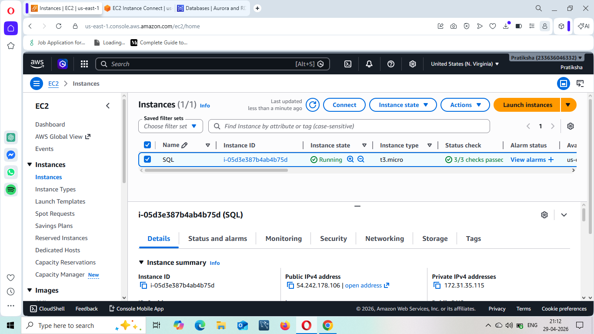
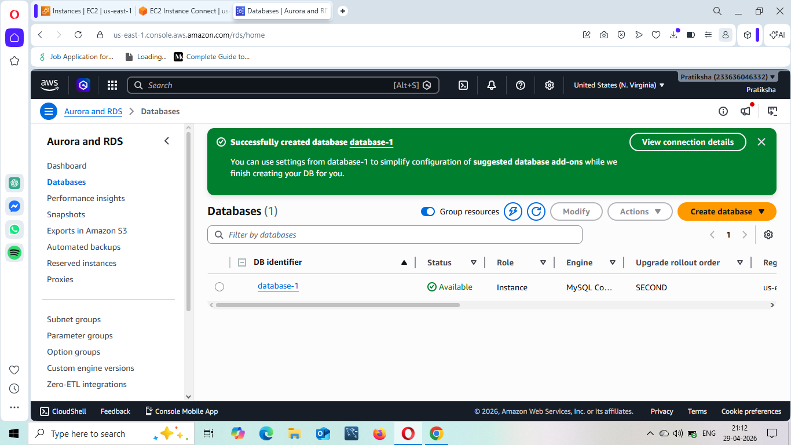
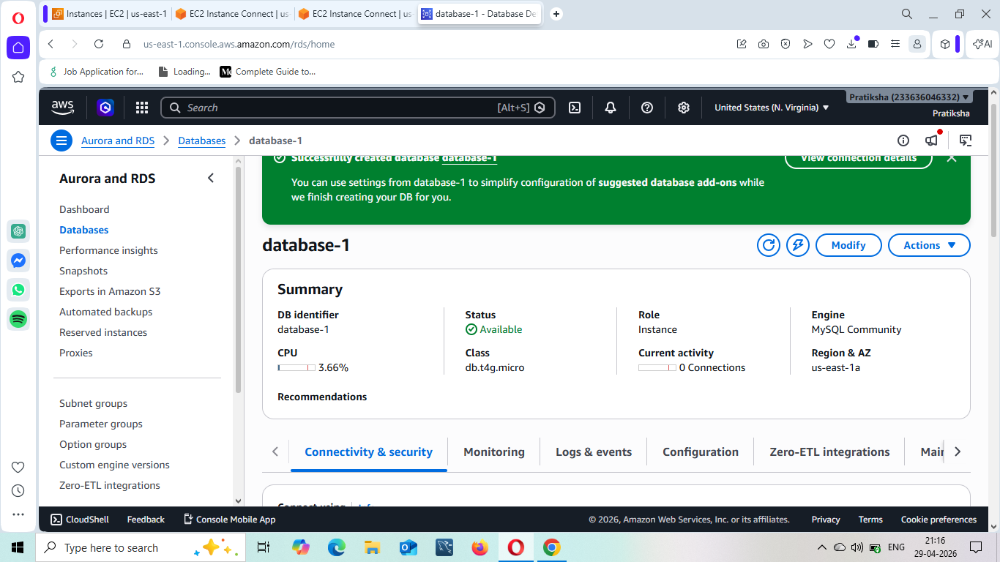
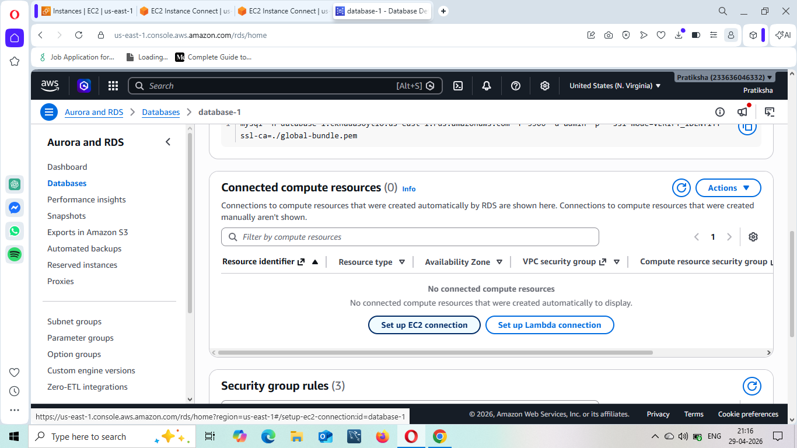
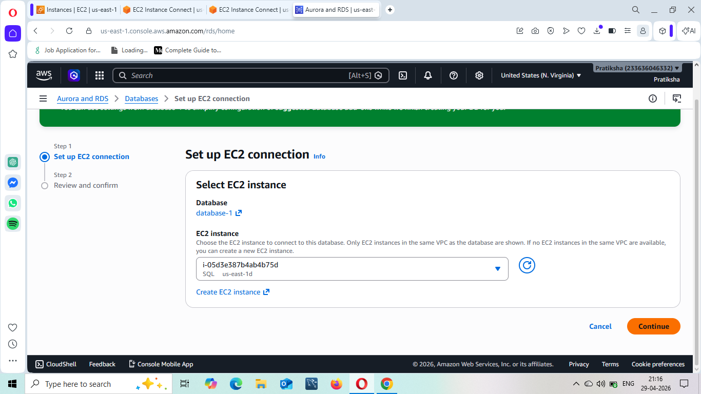
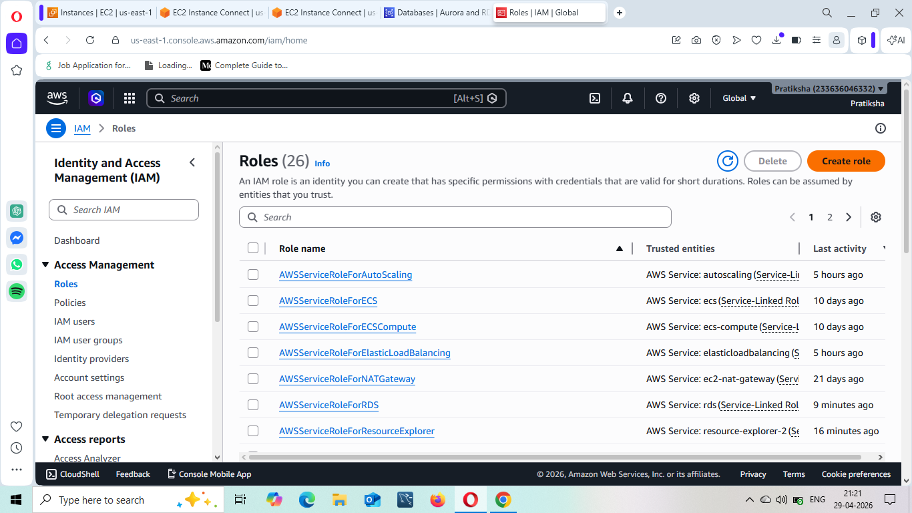
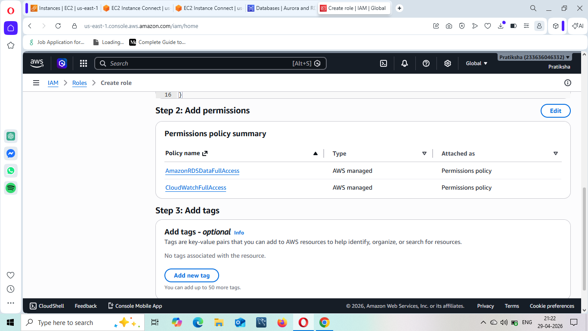
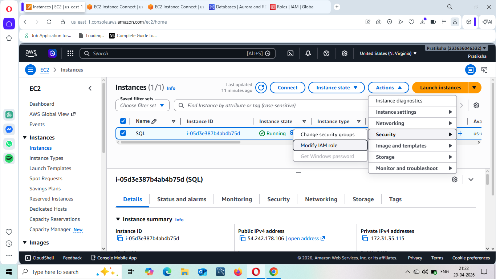
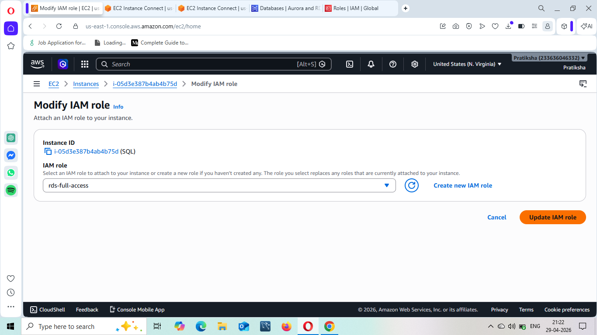

# 📌 EC2 to RDS MySQL Connection (AWS Project)

## 🚀 Project Overview

This project demonstrates how to connect an EC2 Ubuntu instance with an RDS MySQL database and perform basic database operations using the MySQL client.

---

## 🧰 Services Used

* Amazon EC2 (Ubuntu)
* Amazon RDS (MySQL)
* IAM

---

## ⚙️ Step 1: Launch EC2 Instance

* Launch an Ubuntu EC2 instance
* Ensure:

  * Security group allows SSH (port 22)
  * You have your `.pem` key file

---

## 🗄️ Step 2: Create RDS MySQL Database

* Go to RDS → Create Database
* Choose:

  * Engine: MySQL
* Set:

  * DB name, username, password
* Important:

  * Enable Public Access (if required)
  * Configure Security Group to allow MySQL (port 3306) from EC2
    

---

## 🔗 Step 3: Connect EC2 with RDS

* Go to:

  * RDS → Database → Connectivity
* Under **Connected compute resources**

  * Add your EC2 instance
  
  
  
  
  

---

## 🔐 Step 4: Attach IAM Role (Optional)

* Go to EC2 → Actions → Security → Modify IAM Role
* Attach:

  * AmazonRDSFullAccess
  * AmazonCloudWatchFullAccess
    
    
    
    

---

## 💻 Step 5: Install MySQL Client on EC2

SSH into EC2 and run:

```bash
sudo apt-get update
sudo apt install mysql-client -y
```

---

## 🔌 Step 6: Connect to RDS from EC2

```bash
mysql -u admin -h <RDS-ENDPOINT> -P 3306 -p
```

Enter your password when prompted.

---

## 🗃️ Step 7: Database Operations

```sql
CREATE DATABASE aws;
USE aws;

CREATE TABLE table1 (
    id INT,
    name VARCHAR(50)
);
```

---

---

## 🎯 Key Learnings

* Connecting EC2 and RDS
* Using MySQL client on Linux
* Performing basic database operations

---

## ⚠️ Common Issues

* Connection timeout → Check security groups (port 3306)
* Access denied → Verify credentials
* Incorrect endpoint → Double-check RDS endpoint

---

